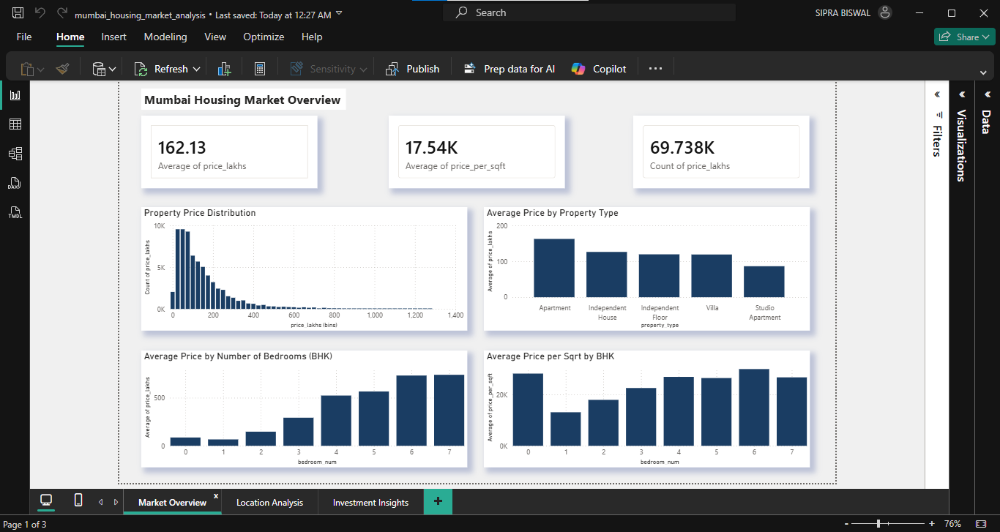
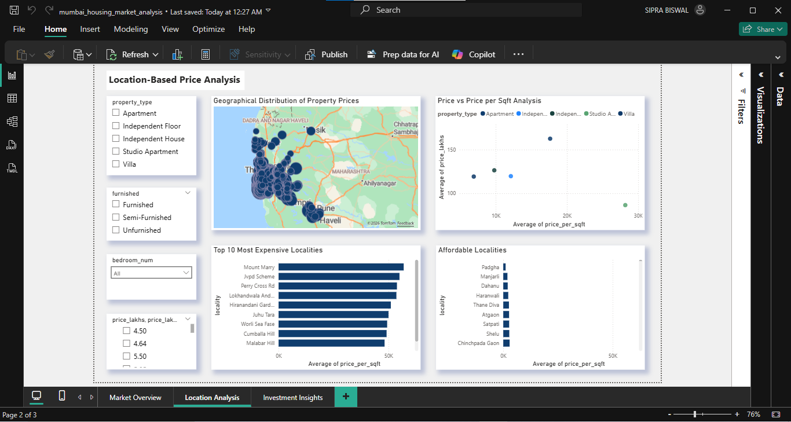
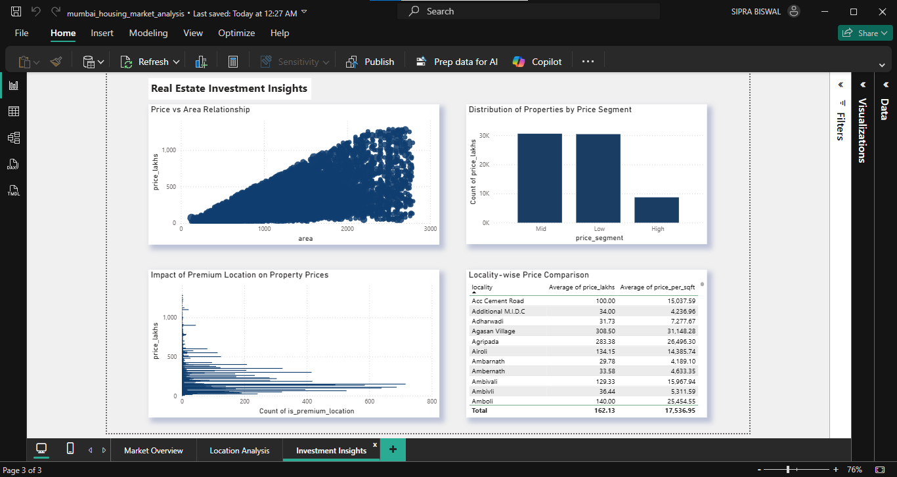

# 🏡 Mumbai Housing Market Analysis & Investment Insights

 
 
 
 

---

## 📌 Project Summary
An end-to-end **data analysis project** focused on understanding the **Mumbai housing market**, uncovering pricing patterns, and identifying **investment opportunities** using real-world data.

This project combines **Python, SQL, and Power BI** to transform raw data into **actionable business insights**.

👉 Designed to answer:
- *Where should you invest?*  
- *Which areas are overpriced?*  
- *What factors truly drive property prices?*  

---

## 🚀 Key Highlights
- 📊 Built an **interactive Power BI dashboard** with 3 analytical layers  
- 🧠 Identified **pricing inefficiencies across localities**  
- 📍 Performed **location-based market segmentation**  
- 📈 Analyzed relationship between **price, area, and BHK**  
- 💡 Generated **investment-focused insights**, not just visuals  

---

## 🎯 Business Problem
Real estate decisions are often driven by intuition rather than data.

Key challenges:
- Lack of clarity on **fair property valuation**  
- Difficulty in comparing **locations objectively**  
- Identifying **high-growth vs overpriced areas**  

👉 This project enables **data-driven decision-making** for buyers and investors.

---

## 🔄 Project Workflow
1. Data Understanding  
2. Data Cleaning & Preprocessing  
3. Exploratory Data Analysis (EDA)  
4. SQL-Based Business Analysis  
5. Feature Exploration  
6. Dashboard Development (Power BI)  
7. Insight Generation & Recommendations  

---

## ❓ Key Questions Answered
- How are property prices distributed across Mumbai?  
- Which property types command the highest prices?  
- How does BHK impact pricing trends?  
- Which localities are most expensive vs affordable?  
- Does higher area always mean higher value?  
- Where do we see **price inefficiencies**?  

---

## 📊 Dataset Overview
The dataset includes property-level information:

- `price_lakhs` → Total property price  
- `price_per_sqft` → Cost efficiency metric  
- `area` → Property size  
- `bedroom_num (BHK)` → Number of bedrooms  
- `property_type` → Apartment, Villa, etc.  
- `locality` → Geographic location  
- `furnished` → Furnishing status  

---

## 📈 Key Metrics (KPIs)
- Average Property Price  
- Average Price per Sqft  
- Total Listings  
- Price Distribution  
- Locality-wise Price Trends  
- Property Type Comparison  

---

## 🧹 Data Preparation (Python)
- Handled missing and inconsistent data  
- Standardized numerical and categorical features  
- Treated outliers in price and area  
- Cleaned categorical variables for analysis  
- Prepared structured dataset for visualization  

---

## 🛠 SQL Analysis
Performed business-oriented analysis using SQL:

- Locality-wise price comparison  
- Property type pricing trends  
- BHK-based segmentation  
- Identification of expensive vs affordable regions  
- Ranking localities using window functions  

---

## 📊 Exploratory Data Analysis (EDA)

### Key Observations:
- Property prices are **highly skewed**, indicating luxury market influence  
- Strong correlation between **area and total price**  
- Larger BHKs increase price but not always value  
- Significant variation in **price per sqft across locations**  

---

## 📊 Dashboard (Power BI)

### 🔹 Market Overview
- KPI Cards (Price, Price per Sqft, Listings)  
- Price Distribution  
- Price by Property Type  
- Price by BHK  

---

### 🔹 Location Analysis
- Interactive Map (Geographical Insights)  
- Price vs Price per Sqft (Scatter Plot)  
- Top 10 Expensive Localities  
- Top 10 Affordable Localities  

---

### 🔹 Investment Insights
- Price vs Area Relationship  
- Price Segment Distribution  
- Premium Location Impact  
- Locality-wise Comparison Table  

---

## 📊 Key Insights

- 📍 Premium localities dominate **price per sqft**, not always value  
- 📏 Larger homes increase price, but **cost efficiency varies**  
- 💰 Some mid-tier locations offer **better investment potential**  
- ⚖️ Price per sqft is a more reliable metric than total price  

---

## 💡 Business Recommendations

- Focus on **price per sqft for fair comparison**  
- Target **mid-range localities for better ROI**  
- Avoid overpaying in premium zones without value justification  
- Monitor emerging areas for **future growth opportunities**  

---

## 🛠 Tools & Technologies

- **Python** → Data Cleaning & EDA  
- **SQL (MySQL)** → Analytical Queries  
- **Power BI** → Dashboard & Visualization  

---

## 📊 Dashboard Preview

### 🔹 Market Overview

### 🔹 Location Analysis

### 🔹 Investment Insights

---

## 🧠 Key Learnings

- Importance of **cleaning and structuring real-world data**  
- Translating business problems into **analytical questions**  
- Building dashboards that **drive decisions, not just visuals**  
- Communicating insights effectively through storytelling  

---

## 📌 Conclusion
This project demonstrates how data analytics can transform raw housing data into **strategic insights for smarter real estate decisions**.

---

## 📫 Connect With Me
- LinkedIn: https://www.linkedin.com/in/siprabiswal08/
- Email: bsipra444@gmail.com

I'm open to opportunities in Data Analytics and would love to connect!
